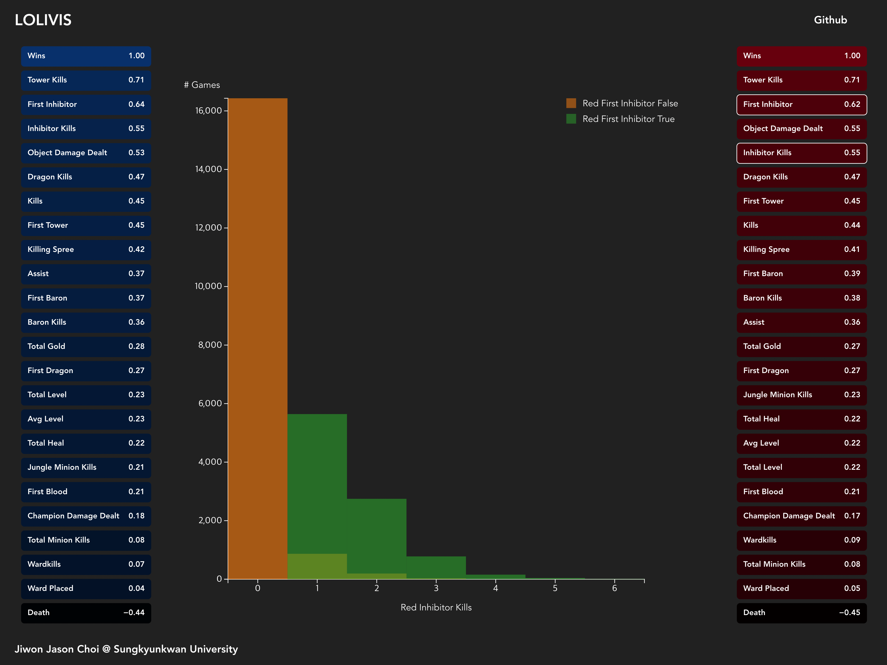

# LOLIVIS: League of Legends Match Data Interactive Visualization



<br>

LOLIVIS is web-based interactive visualization for League of Legends match data. 

<br>

## Live Demo
[git.jasonchoi.dev/LOLIVIS](https://git.jasonchoi.dev/LOLIVIS)

## Implementation
Implemented with
[TypeScript](https://github.com/microsoft/TypeScript),
[Vite](https://github.com/vitejs/vite),
[D3.js](https://github.com/d3/d3),
[d3-legend](https://github.com/susielu/d3-legend),
[Bootstrap](https://getbootstrap.com)

## Development
Install node.js and Yarn.

Clone this Repository

```
git clone https://github.com/Jason-Choi/LOLIVIS.git
cd LOLIVIS
```

Run with Vite Dev Server
```
yarn dev
```

\* Note that you do not have to install dependencies. All dependencies are uploaded in repository using ZipFS. 

## Acknolowgement
[Dataset by Minyoung Shin and Riot Games](https://www.kaggle.com/datasets/gyejr95/league-of-legends-challenger-ranked-games2020)